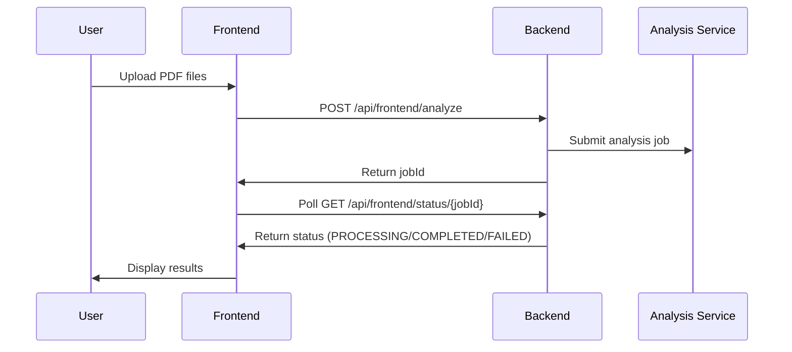
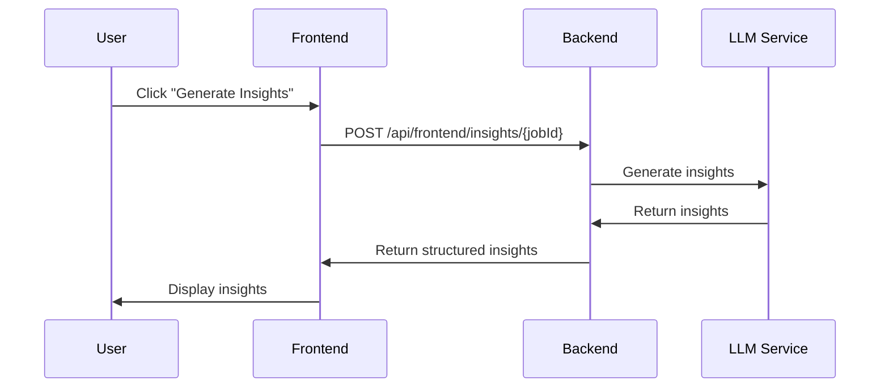
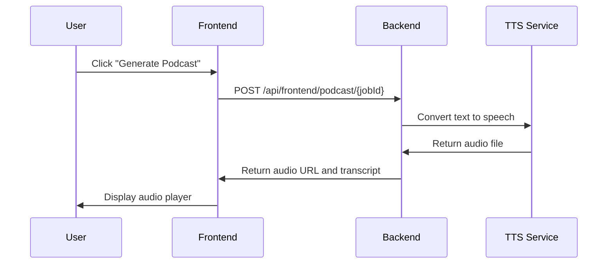

# Backend-Frontend Integration Guide

This guide explains how the Spring Boot backend and Next.js frontend are integrated to provide a seamless AI-powered document analysis experience.

## 🏗️ Architecture Overview

```
┌─────────────────┐    HTTP/JSON    ┌─────────────────┐
│   Next.js       │ ◄─────────────► │  Spring Boot    │
│   Frontend      │                 │   Backend       │
│   (Port 3000)   │                 │   (Port 8080)   │
└─────────────────┘                 └─────────────────┘
         │                                   │
         │                                   │
         ▼                                   ▼
┌─────────────────┐                 ┌─────────────────┐
│   Browser       │                 │   H2 Database   │
│   (Chrome)      │                 │   (In-Memory)   │
└─────────────────┘                 └─────────────────┘
```

## 🔗 Integration Points

### 1. API Communication Layer

The frontend communicates with the backend through a centralized API service (`Frontend/lib/api.ts`):

```typescript
class ApiService {
  private baseUrl: string

  constructor() {
    this.baseUrl = process.env.NEXT_PUBLIC_API_URL || 'http://localhost:8080'
  }

  // Health check
  async healthCheck(): Promise<boolean>
  
  // Document analysis
  async analyzeDocuments(formData: FormData, persona: string, jobToBeDone: string)
  
  // Job status polling
  async getJobStatus(jobId: string)
  
  // Insights generation
  async generateInsights(jobId: string, selectedText?: string)
  
  // Podcast generation
  async generatePodcast(jobId: string)
}
```

### 2. Backend API Endpoints

The backend provides dedicated endpoints for frontend integration:

#### Frontend Integration Controller (`/api/frontend/`)
- `POST /analyze` - Upload and analyze PDF documents
- `GET /status/{jobId}` - Get analysis job status
- `POST /insights/{jobId}` - Generate insights for a document
- `POST /podcast/{jobId}` - Generate podcast from insights
- `GET /health` - Health check endpoint

#### Adobe Challenge Controller (`/api/adobe/`)
- `POST /analyze` - Full Adobe Challenge analysis
- `GET /related-sections/{jobId}/{sectionId}` - Get related sections
- `GET /accuracy/{jobId}` - Get section accuracy validation
- `GET /performance` - Get performance metrics

## 🔄 Data Flow

### 1. Document Upload and Analysis



### 2. Insights Generation



### 3. Podcast Generation



## 📊 Data Models

### Frontend Data Structures

```typescript
interface Document {
  id: string
  name: string
  content: string
  uploadedAt: Date
  jobId?: string
}

interface Insight {
  id: string
  type: 'key_point' | 'summary' | 'connection' | 'question'
  title: string
  content: string
  confidence: number
  sources: string[]
}

interface RelatedSection {
  id: string
  title: string
  content: string
  similarity: number
  documentName: string
}
```

### Backend Data Structures

```java
public class AdobeAnalysisRequest {
    private String persona;
    private String jobToBeDone;
    private boolean generateInsights;
    private boolean enablePodcastMode;
}

public class AdobeAnalysisResponse {
    private String jobId;
    private String status;
    private String extractedContent;
    private List<Section> sections;
    private List<Insight> insights;
    private PodcastContent podcast;
}

public class JobStatusResponse {
    private String jobId;
    private String status;
    private int progress;
    private String message;
    private String result;
}
```

## 🔧 Configuration

### CORS Configuration

The backend is configured to accept requests from the frontend:

```yaml
cors:
  allowed-origins: "http://localhost:3000,http://0.0.0.0:3000,https://*.replit.dev"
  allowed-methods: "GET,POST,PUT,DELETE,OPTIONS"
  allowed-headers: "*"
  allow-credentials: true
```

### Environment Variables

#### Frontend (.env.local)
```env
NEXT_PUBLIC_API_URL=http://localhost:8080
```

#### Backend (application.yml)
```yaml
server:
  port: 8080
  address: 0.0.0.0

app:
  analysis:
    enhanced:
      enabled: true
      max-sections-per-document: 5
      confidence-threshold: 0.7
```

## 🚨 Error Handling

### Frontend Error Handling

1. **Network Errors**: Automatic retry with exponential backoff
2. **Backend Unavailable**: Graceful fallback to mock data
3. **File Validation**: Client-side validation before upload
4. **User Feedback**: Toast notifications for all operations

```typescript
try {
  const result = await apiService.analyzeDocuments(formData)
  // Handle success
} catch (error) {
  if (!backendHealthy) {
    // Use fallback data
    setDocuments(fallbackDocuments)
  } else {
    // Show error message
    toast({
      title: "Upload failed",
      description: "Please try again",
      variant: "destructive"
    })
  }
}
```

### Backend Error Handling

1. **Global Exception Handler**: Centralized error processing
2. **Structured Responses**: Consistent error format
3. **Logging**: Comprehensive error logging
4. **Validation**: Input validation and sanitization

```java
@ControllerAdvice
public class GlobalExceptionHandler {
    
    @ExceptionHandler(Exception.class)
    public ResponseEntity<Map<String, Object>> handleException(Exception e) {
        Map<String, Object> response = new HashMap<>();
        response.put("success", false);
        response.put("error", e.getMessage());
        response.put("timestamp", System.currentTimeMillis());
        
        logger.error("Global exception handler", e);
        return ResponseEntity.internalServerError().body(response);
    }
}
```

## 📈 Performance Optimization

### Frontend Optimizations

1. **Lazy Loading**: Components loaded on demand
2. **Memoization**: React.memo for expensive components
3. **Debouncing**: API calls debounced to prevent spam
4. **Caching**: Browser caching for static assets

### Backend Optimizations

1. **Async Processing**: Long-running operations handled asynchronously
2. **Connection Pooling**: Database connection optimization
3. **Caching**: Spring Cache for frequently accessed data
4. **Compression**: HTTP compression enabled

## 🧪 Testing Integration

### Manual Testing

1. **Start both services**:
   ```bash
   ./run-app.sh
   ```

2. **Test integration**:
   ```bash
   ./test-integration.sh
   ```

3. **Verify endpoints**:
   - Frontend: http://localhost:3000
   - Backend Health: http://localhost:8080/api/frontend/health
   - Integration Test: http://localhost:3000/api/test-integration

### Automated Testing

```bash
# Backend tests
cd Backend
./mvnw test

# Frontend tests
cd Frontend
npm test

# Integration tests
npm run test:integration
```

## 🔍 Monitoring and Debugging

### Frontend Monitoring

1. **Browser Console**: Check for JavaScript errors
2. **Network Tab**: Monitor API calls and responses
3. **React DevTools**: Component state and props
4. **Performance Tab**: Load times and bottlenecks

### Backend Monitoring

1. **Application Logs**: Check console output or log files
2. **Health Endpoints**: Monitor service health
3. **Performance Metrics**: Track response times
4. **Database Monitoring**: H2 console for data inspection

### Common Debugging Scenarios

1. **CORS Errors**: Check CORS configuration in backend
2. **API Timeouts**: Verify backend is running and responsive
3. **File Upload Issues**: Check file size limits and validation
4. **Analysis Failures**: Review backend logs for processing errors

## 🚀 Deployment Considerations

### Development Environment

- Backend: `java -jar target/Adobe1B.jar`
- Frontend: `npm run dev`
- Database: H2 in-memory
- CORS: Localhost origins

### Production Environment

- Backend: Docker container with external database
- Frontend: Static build with CDN
- Database: PostgreSQL with connection pooling
- CORS: Specific domain origins
- Load Balancer: Nginx for traffic distribution

## 📚 Additional Resources

- [Spring Boot Documentation](https://spring.io/projects/spring-boot)
- [Next.js Documentation](https://nextjs.org/docs)
- [Adobe Challenge Requirements](./README.md)
- [API Documentation](./API_DOCUMENTATION.md)

## 🤝 Support

For integration issues:

1. Check the troubleshooting section in the main README
2. Review application logs for error details
3. Test individual endpoints using the test script
4. Verify network connectivity between services
5. Ensure all dependencies are properly installed
